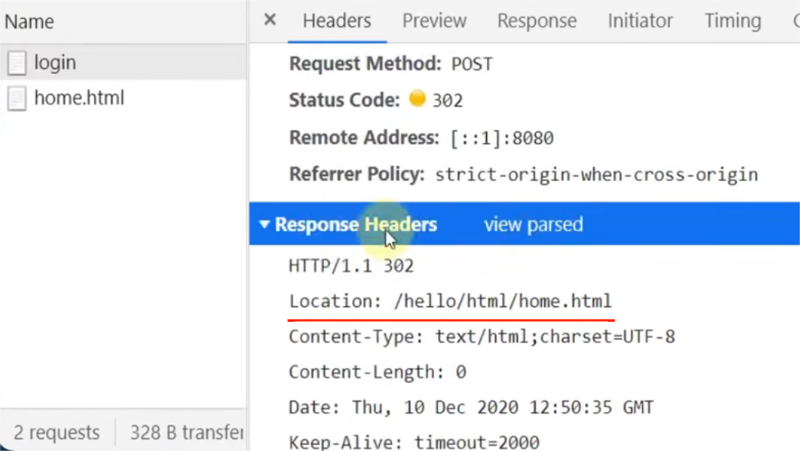

## 1.状态码

400状态码也可以由开发人员返回（请求参数有误），而请求的语法错误，会直接由服务器判断返回400

  

服务器通过URL或者请求头判断是否愿意接收客户端发来的请求，如果拒绝请求，那请求体就白发了

如果发的请求，服务器很可能不接受，可以先发不带请求体的请求，如果服务器拒绝请求，就不会浪费资源，如果允许该请求，就会返回100的状态码，让客户端 继续发送带请求体的请求

302 Found：重定向，响应头的Location字段

前后端分离模式下，具体跳转都是前端控制的，一般不用重定向

304 静态资源一般都会缓存到客户端，再次发送请求，如果数据未发生改变，服务器就会返回304，客户端一但拿到304，就会直接使用缓存里的资源

服务器只是判断资源是否有改动，无改动返回304，至于客户端缓存被清，与服务器无关

缓存在HTTP请求里，是多个头部字段共同起作用

第一次请求，返回200

再次请求，返回304，只返回状态行和响应头

## 2.form提交

表单只支持GET、POST请求

Java里enctype为application/x-www-form-urlencoded时，通过req.getParameter( )获取参数

enctype为multipart/form-data时，不能通过req.getParameter( )获取参数，最好使用第三方库commons-fileupload实现

encapsulation代表一个参数

表单提交GET请求，是把参数直接拼接在URL里 

表单提交POST请求，enctype为application/x-www-form-urlencoded时，数据放在请求体里，Content-Type为application/x-www-form-urlencoded，文件上传采用该种方式只会把文件名提交给服务器，并没有提交文件数据

表单提交POST请求，enctype为multipart/form-data时，Content-Type为multipart/form-data，并且有boundary分割线（分割请求参数）  文件数据相较普通参数多出 filename和Content-Type

表示结束

 

