## 1.跨域

前后端分离模式下，至少有两台服务器

浏览器访问页面服务器，由于同源策略，两个服务器不同源，无法发AJAX请求给后台服务器，如果服务器没做跨域，JSON数据其实已经给了浏览器，但浏览器没有发现响应头里的Access-Control-Allow-Origin字段，认为拿到的资源无权给页面

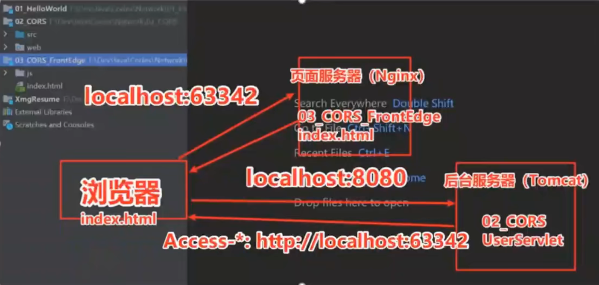

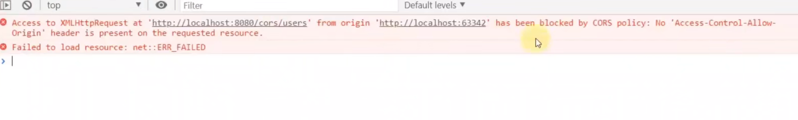

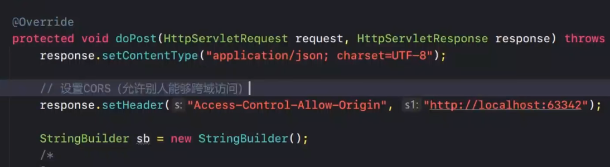

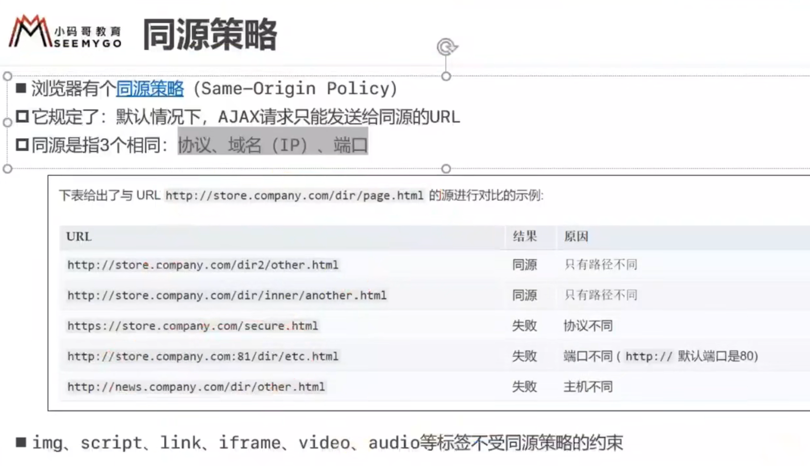

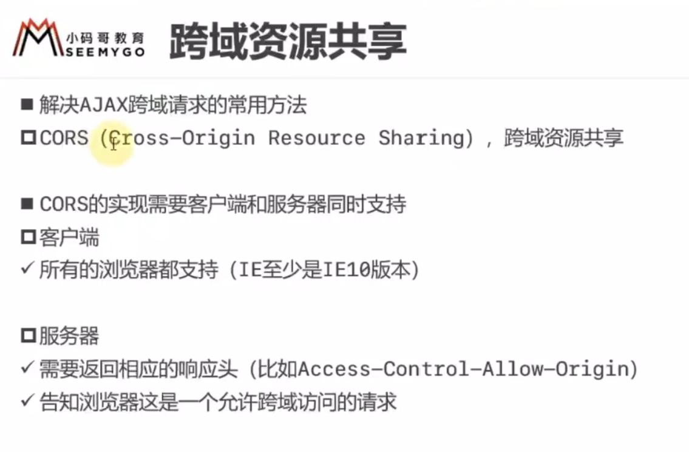


## 2.Cookie

默认情况下，关闭浏览器，Cookie的SessionId数据会丢失

一种浏览器对应一个Cookie，Cookie不共用 

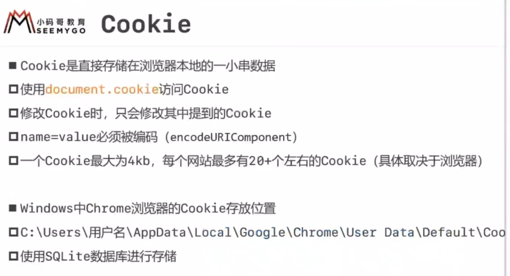

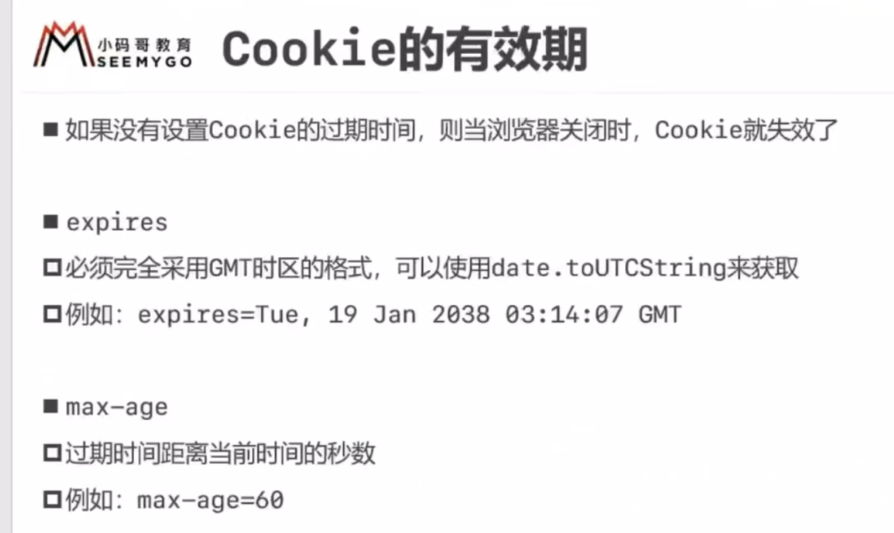

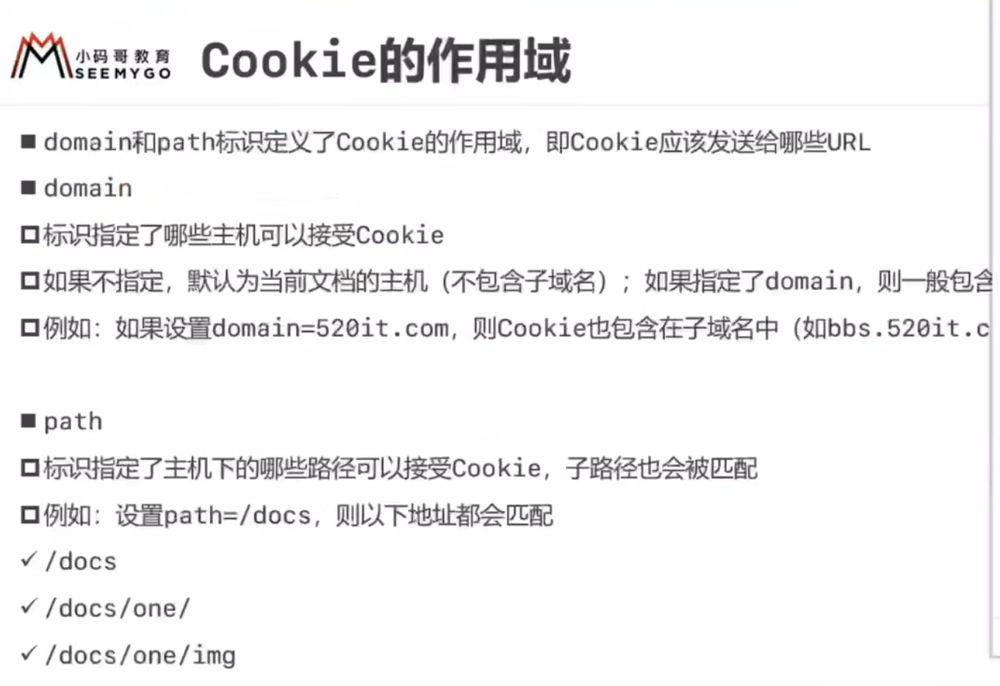

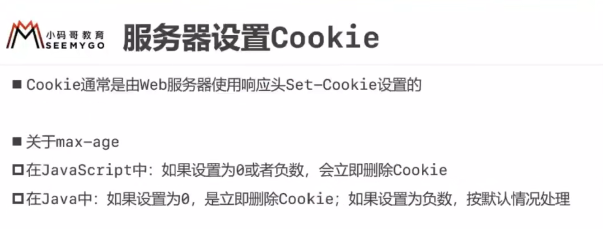 

一但登录成功，会创建一个Session，并有唯一SessionId，响应头里的Set-Cookie里会带有SeesionId，domain，path，存储到浏览器的Cookie中（本地硬盘），再次请求，如果domain和path匹配会在请求头里发送Cookie过去，如果id相同，则返回数据，id不同，则重定向到登录页面

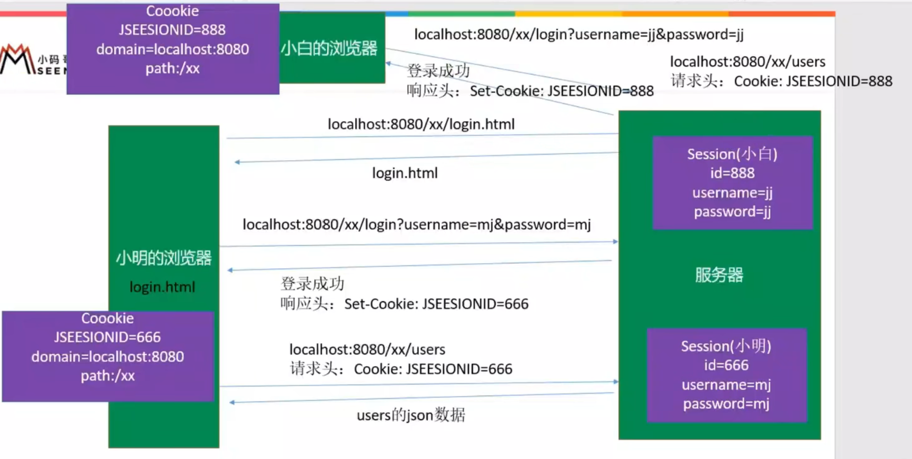

多个页面添加商品，利用Cookie和Session识别会话域，把商品id存储在Session里，也可以直接存入数据库，如果是直接存入数据库，手机端或者小程序里打开购物车，会发现添加了商品，如果是存储在Session里，则不会看到添加的商品，因为Cookie存在于浏览器

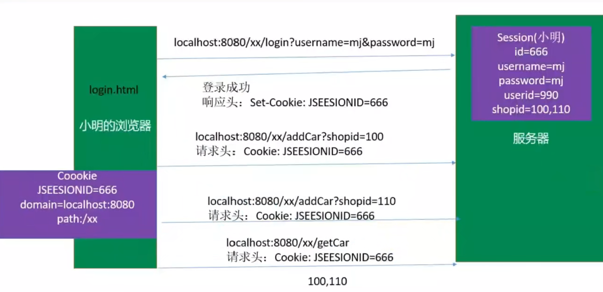


不仅Cookie里要有对应的SessionId，且必须是 登录成功过的

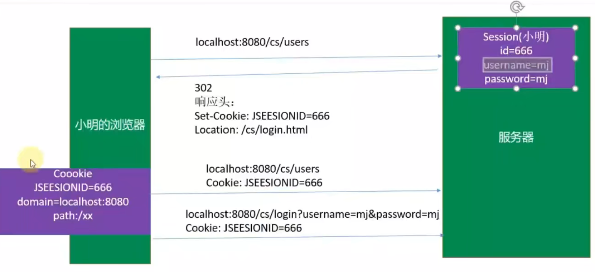

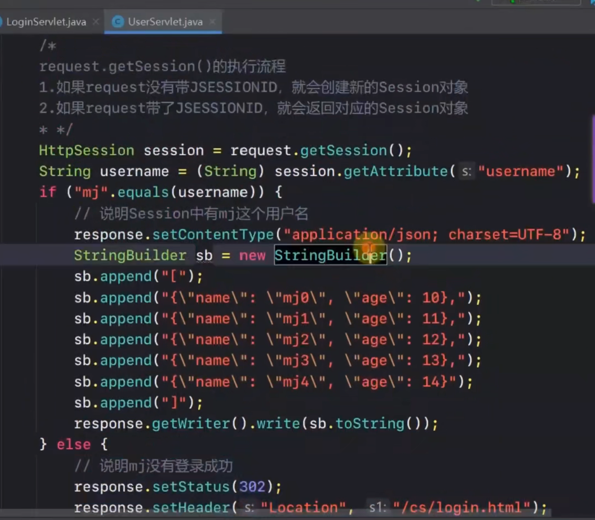


​	Cookie（HTTP Cookie）是一种小型的文本文件，通常由Web服务器在用户访问网站时发送到用户的浏览器中，然后由浏览器在用户本地存储。Cookie 主要用于在客户端（用户的计算机）和服务器之间传递信息，以便跟踪用户的状态、身份验证、个性化用户体验、数据分析等目的。以下是Cookie的概述：

1. **创建和存储位置：** 服务器通过HTTP响应的"Set-Cookie"标头将Cookie发送到用户的浏览器。浏览器将这些Cookie存储在用户的计算机上，通常以文本文件的形式存储在浏览器的Cookie存储中。每个Cookie都与特定的域名相关联，只能由与该域名相关的Web页面访问。

2. **结构：** 一个Cookie通常由一个名称-值对组成，以及一些可选的属性。例如：

   ```
   CookieName=CookieValue; Expires=ExpirationDate; Path=Path; Domain=DomainName; Secure; HttpOnly
   ```

   - `CookieName` 是Cookie的名称，用于标识Cookie。
   - `CookieValue` 是与Cookie相关联的数据。
   - `Expires` 指定Cookie的过期日期和时间。
   - `Path` 指定Cookie可用于哪个路径。
   - `Domain` 指定Cookie可用于哪个域。
   - `Secure` 表示该Cookie只在安全的HTTPS连接中传输。
   - `HttpOnly` 表示Cookie仅能通过HTTP协议访问，而不能通过JavaScript来访问。

3. **用途：** Cookie的主要用途包括：

   - **会话管理：** 用于跟踪用户的会话状态，以保持用户登录状态。
   - **个性化体验：** 存储用户首选项和设置，以提供个性化的用户体验。
   - **跟踪和分析：** 用于跟踪用户在网站上的行为，进行数据分析。
   - **广告定位：** 用于创建用户的广告个人资料，以投放相关广告。
   - **安全性：** 用于防止跨站点请求伪造（CSRF）等安全问题。

4. **隐私和安全性：** Cookie可能包含用户的敏感信息，因此需要谨慎处理，以保护用户的隐私。浏览器提供了控制Cookie的选项，用户可以选择删除、禁用或限制Cookie的使用。

5. **会话Cookie和持久Cookie：** 有两种主要类型的Cookie：

   - 会话Cookie（Session Cookie）：存储在浏览器内存中，仅在用户的会话期间有效，关闭浏览器后会被删除。
   - 持久Cookie（Persistent Cookie）：具有指定的过期日期，可以在多次会话之间保留。

总之，Cookie是一种在Web开发中广泛使用的机制，用于在客户端和服务器之间传递数据，以实现多种目的，包括会话管理、用户跟踪、个性化体验、安全性和数据分析等。但要注意在处理用户数据时要遵守隐私法规，并采取适当的安全措施。


## 3.Session

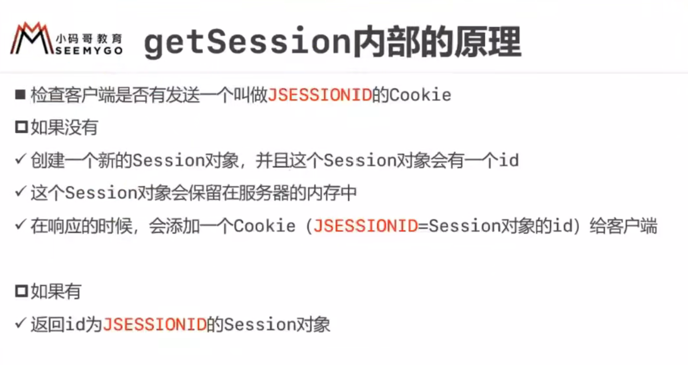

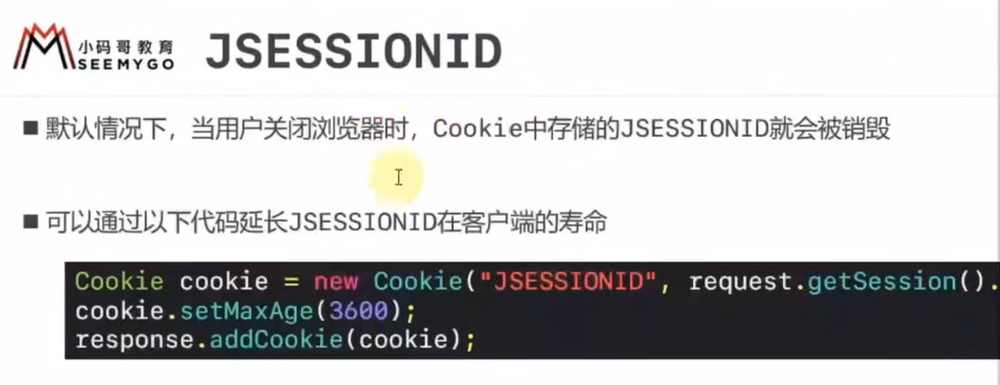

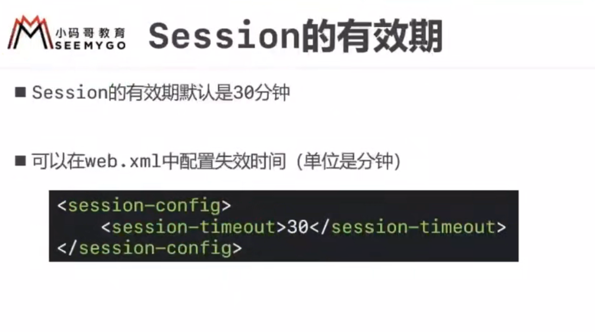

​	Session（会话）是计算机科学和网络编程中的一个概念，用于跟踪和管理用户与服务器之间的交互。会话通常用于Web应用程序中，以存储和管理用户在一段时间内的状态和数据。以下是Session的概述：

1. **会话的目的：** 会话的主要目的是跟踪用户的状态和维护用户的上下文信息，以便在多个HTTP请求之间共享数据。这有助于在Web应用程序中保持用户的登录状态、存储购物车内容、跟踪用户首选项等。
2. **工作原理：** 会话通常依赖于服务器端和客户端之间的唯一标识符，通常称为会话ID（Session ID）。会话ID可以存储在Cookie中，也可以作为URL参数传递给服务器。当用户首次访问服务器时，服务器会为其创建一个新的会话，并生成一个唯一的会话ID。该ID将用于标识用户的会话，并存储在服务器端。随后的HTTP请求中，浏览器将会话ID发送回服务器，以便服务器能够识别用户的会话，并将相关数据与该会话关联起来。
3. **数据存储：** 在会话中，服务器通常会存储与用户相关的数据。这些数据可以是用户的身份验证信息、购物车内容、首选项设置等。数据可以存储在服务器的内存中、数据库中或其他持久性存储中，具体取决于应用程序的需求和设计。
4. **生命周期：** 会话可以有不同的生命周期，通常分为以下两种类型：
   - **会话级别的持久性（Session-level Persistence）：** 会话数据在用户会话期间一直存在，用户关闭浏览器后会话数据被销毁。
   - **持久性（Persistence）：** 会话数据可以在多个用户会话之间保留，通常用于实现"记住我"功能，或者在一定时间内保留用户的状态信息。
5. **安全性和隐私：** 会话数据通常包含用户的敏感信息，因此需要采取安全措施来保护数据。这包括使用加密传输会话ID，限制会话数据的访问权限，以及定期清理过期的会话。
6. **Web应用程序中的应用：** 会话在Web应用程序中广泛应用于用户身份验证和授权、购物车管理、个性化用户体验、数据共享等方面。它们是实现复杂Web应用程序功能的重要组成部分。

总之，会话是一种用于跟踪和管理用户与服务器之间交互的机制，特别在Web应用程序中具有广泛的应用。会话通过存储和维护用户的状态信息来提供更好的用户体验，并且需要在安全性和隐私方面谨慎处理。

## 4.两者区别

由于HTTP是无状态协议，用Cookie和Session进行会话跟踪，确定请求之间是否有联系

Cookie（HTTP Cookie）和Session（会话）都是用于在Web开发中管理用户状态和跟踪用户信息的工具，但它们有一些关键的区别：

1. **存储位置：**
   - **Cookie：** Cookie是存储在客户端（用户的浏览器）中的小型文本文件，由服务器发送到浏览器，并在本地存储在用户的计算机上。
   - **Session：** 会话数据通常存储在服务器端，而不存储在客户端。客户端只存储一个会话标识符（通常是会话ID），该标识符用于在服务器端检索相关会话数据。
2. **数据类型：**
   - **Cookie：** Cookie通常只包含键值对的文本数据，存储在用户的浏览器中。它们通常用于存储少量的、持久性的数据，如用户首选项、登录状态等。
   - **Session：** 会话可以包含更丰富和复杂的数据，包括对象、数组和其他数据结构。它们通常用于在服务器上存储临时性的、与用户会话相关的数据。
3. **生命周期：**
   - **Cookie：** Cookie可以有指定的过期日期和时间，可以是会话级别的（在用户关闭浏览器后删除）或持久性的（在指定的过期日期前保留）。
   - **Session：** 会话通常在用户会话期间保持活动，并在用户关闭浏览器或会话超时后销毁。
4. **安全性：**
   - **Cookie：** Cookie存储在用户的计算机上，因此可能会受到一些安全威胁，如窃取或修改。可以通过设置Cookie的安全属性来增强安全性，例如HttpOnly和Secure标志。
   - **Session：** 由于会话数据存储在服务器上，因此更难受到直接的客户端攻击。然而，会话ID可能会受到会话劫持（Session Hijacking）的威胁，因此需要一些额外的安全措施。
5. **使用场景：**
   - **Cookie：** 通常用于存储用户的身份验证状态、个性化首选项、购物车内容以及在客户端需要的数据。
   - **Session：** 通常用于在服务器上存储和管理用户的身份验证信息、用户状态、购物车、缓存等，以及在多个HTTP请求之间共享数据。

总之，Cookie和Session都用于在Web应用程序中管理用户状态和数据，但它们在数据存储位置、数据类型、生命周期、安全性和使用场景等方面存在重要的区别。选择使用哪种方法通常取决于特定的应用需求和安全性考虑。有时，它们也可以一起使用，将会话ID存储在Cookie中以建立会话连接。

## 5.HTTP无状态

HTTP（Hypertext Transfer Protocol）是一种用于在计算机之间传输数据的协议。HTTP被认为是一种“无状态”协议，这意味着每个HTTP请求都独立于之前的请求，服务器不会保持关于客户端的状态信息。

HTTP的无状态性质有以下几个重要方面：

1. 每个请求都是独立的：当客户端发送HTTP请求时，服务器只会针对当前请求的信息进行处理，而不会考虑之前或之后的请求。这使得HTTP非常简单和可扩展，因为服务器不需要维护大量的连接状态信息。
2. 无客户端状态保存：HTTP服务器不会在多个请求之间保持客户端的状态信息。这意味着每个请求都必须包含足够的信息，以便服务器能够理解客户端的意图。为了实现状态管理，通常使用一些技术，如Cookies或会话（Session）。
3. 可缓存性：由于HTTP是无状态的，服务器响应可以被缓存，以提高性能。缓存可以减少对服务器的请求，加速页面加载速度，但需要确保缓存的数据仍然有效。

虽然HTTP本身是无状态的，但通过使用Cookies、会话管理和其他技术，可以在HTTP应用程序中实现状态管理，以便跟踪用户的会话信息和其他状态。这些机制使得HTTP可以应对更复杂的应用场景，例如电子商务网站、社交媒体平台和在线银行。但无论如何，HTTP的基本特性始终是无状态的。