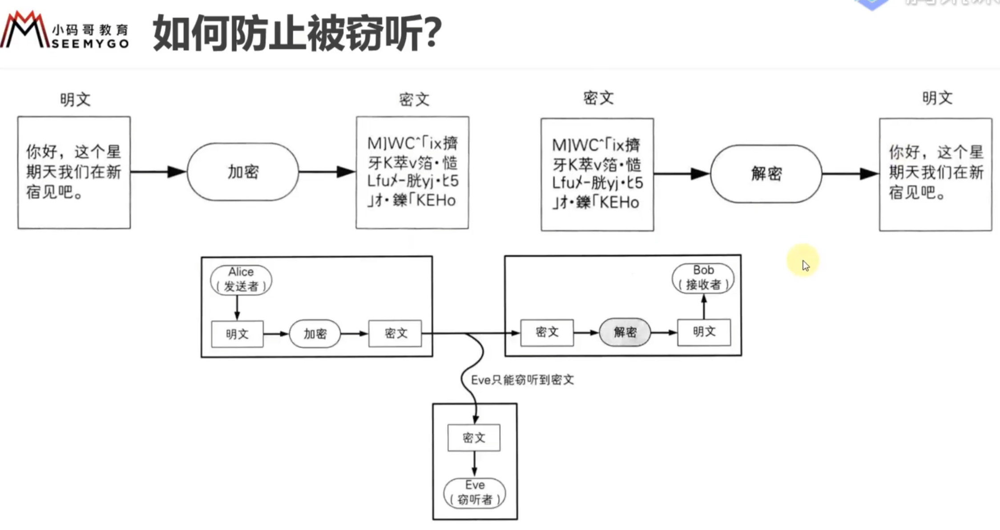

## 1.代理

### 1.1概述

### 1.2正向代理、反向代理

平常一般是局域网，服务器拿到的是转化后的公网IP，如果想隐藏公网IP， 可以找一台代理服务器，服务器拿到的IP就会是代理服务器的，可以隐藏客户端的身份

Internet访问控制，路由器设置只有代理服务器能上网，其他主机想上网只能通过代理服务器，让代理服务器去控制哪台主机可以上网

代理服务器通过负载均衡算法，分配服务器

安全防护，防止直接访问服务器导致超负荷，崩溃宕机

### 1.3抓包工具的原理

代理服务器响应头里有Via，没有X-Forwarder-For和X-Real-IP

私网IP肯定不能公开，客户端真实IP地址就是路由器IP地址

### 1.4相关的头部字段

## 2.CDN

### 2.1概述

### 2.2使用CDN前后

CDN全局负载均衡系统根据源ip地址，返回一台比较近的CDN缓存服务器的ip给主机 

源站就是使用了CDN服务器的起初服务器，比如公司服务器

### 2.3使用举例

静态资源是指在Web应用程序或网站中，不会在每次请求时改变的文件或数据。这些资源通常是固定的，不包含动态内容或用户特定的信息。静态资源通常包括以下类型的文件：

1. **HTML 文件：** HTML文件是网页的基本结构，通常不会在每个请求中发生变化，因此它们被视为静态资源。
2. **CSS 文件：** 层叠样式表（CSS）文件包含网页的样式信息，用于定义页面的布局和外观。通常，CSS文件是静态的，不会在每次请求中更改。
3. **JavaScript 文件：** JavaScript文件包含网页的客户端脚本代码，用于实现互动和动态行为。虽然JavaScript可以用于创建动态内容，但JavaScript文件本身通常是静态的。
4. **图像文件：** 图像文件，如JPEG、PNG、GIF等，通常是静态资源，因为它们包含图像或图形，不会根据用户请求而改变。
5. **字体文件：** 字体文件（如TTF、WOFF等）用于定义文本的字体和样式。字体文件也通常是静态的，不会在每个请求中更改。
6. **音频和视频文件：** 音频和视频文件通常包含媒体内容，如音乐、视频片段等。这些文件也是静态资源，因为它们在每次请求时通常不会更改。
7. **样本数据和配置文件：** 在某些情况下，静态资源还可以包括配置文件、JSON数据文件或其他用于初始化应用程序或提供数据的文件。

静态资源**通常由Web服务器（如Apache、Nginx等）或内容分发网络（CDN）来提供和管理**。这些资源可以通过HTTP请求从服务器或CDN获取，然后由浏览器加载和显示在用户的Web浏览器中，以构建网页。静态资源的使用有助于提高网站性能和加载速度，因为它们可以被缓存并有效地分发给用户，减少了服务器端的计算负载。

## 3.网络安全

### 3.1四种安全威胁

 

### 3.2ARP欺骗 

#### 3.2.1概述

B拿到A的ip和mac地址后，C发送一个ARP响应给B，把响应包里的源IP设为A的IP地址，源MAC设为C的MAC地址，使B记录的A的MAC地址被覆盖成C的MAC地址，会导致想给A发数据，反而发给了C 

可让攻击者获取局域网上的数据包甚至可篡改数据包 

#### 3.2.2核心步骤举例

让网络上特定电脑之间无法正常通信（网络执法官）

希望A和C之间不能通信，主动发ARP请求给A，源ip为C，源MAC地址瞎写的

A想发数据给C，ARP表里的C的MAC地址是瞎写的，发不到C

#### 3.2.3防护

### 3.3Dos攻击

#### 3.3.1概述

**使目标电脑的==网络或系统资源==耗尽，使服务暂时中断或停止**

带宽消耗型，不断去扔UDP数据，占满宽带

资源消耗型，消耗目标的资源直至崩溃

#### 3.3.2攻击

修改SYN里的源ip地址，让目标送SYN-ACK到伪造的ip地址，目标永不可能收到ACK

  

#### 3.3.3防御

### 3.4.DNS劫持

劫持DNS服务器，修改域名指向的ip地址

HTTP劫持，对返回响应里的数据包进行拦截处理 

修改本机DNS服务器地址

### 3.5HTTP协议的安全问题

#### 3.5.1概述

一但被拦截，就能看到给服务器发的数据是什么

#### 3.5.2单向散列函数

##### 1.概述

单向散列函数：当初设计的不可逆，具备单向性

##### 2.特点

#####  3.称呼

##### 4.常见函数

MD5有解密网站，可以根据散列值得到加密内容，通过暴力枚举去破解

##### 5.应用

检验数据是否被篡改、下载的软件是否是正版

即使数据库的数据泄露，拿到的也是加密过的密码

登录功能，前端传来密码，经MD5加密后和数据库中的加密密码进行逻辑判断

## 4.翻墙

​	"翻墙" 是一个俚语，通常指的是绕过网络封锁或审查，以访问被封锁或受限制的互联网内容。在某些国家或网络环境中，政府、公司或其他实体可能会限制或审查互联网上的特定网站、服务或内容，以各种原因，包括政治、文化、安全和合规性考虑。翻墙的目的是通过使用代理服务器、虚拟专用网络（VPN）、代理工具或其他技术手段，绕过这些封锁或审查，从而访问被屏蔽的网站或服务。 

​	翻墙可以有合法的和非法的目的。一些人可能试图翻墙以保护他们的隐私、维护自由访问信息的权利，或访问受限制的信息资源。另一方面，一些人可能试图翻墙以进行非法活动，如访问盗版内容、绕过版权保护、规避网络安全措施等。

​	需要注意的是，在某些地方和情况下，翻墙可能违法或受到法律制裁，因此在使用翻墙技术时需要谨慎，并遵守当地法律和法规。此外，翻墙服务和工具的质量和安全性也各不相同，用户需要谨慎选择并确保其使用的工具是可信的。

## 5.内网穿透

​	内网穿透（Port Forwarding，也称为内部网络穿越或内部端口转发）是一种网络技术，**允许外部网络（通常是互联网）上的计算机或设备访问位于局域网（内部网络）中的内部计算机、服务或资源**。这种技术的**主要目的是克服局域网内部计算机与外部网络之间的隔离，使外部用户能够访问内部资源。**

内网穿透通常用于以下情况：

1. **远程访问：** 允许用户或管理员通过互联网远程访问他们位于公司或家庭内部网络中的计算机或服务器。这对于远程办公、维护服务器或访问个人文件和资源非常有用。
2. **局域网游戏：** 在局域网游戏中，玩家通常需要建立对等连接，内网穿透可以帮助玩家在不同的局域网之间建立直接连接，而不需要依赖中间服务器。
3. **本地开发和测试：** 开发人员可以使用内网穿透来测试网站、Web应用程序或移动应用程序，而无需将它们部署到公共服务器上。

​	内网穿透工作原理通常涉及到一台公共服务器或云服务器，该服务器位于互联网上，并允许外部设备连接。通过将流量从外部设备重定向到内部网络中的特定计算机或服务，内网穿透使外部设备似乎直接连接到内部网络中的设备或服务。这通常需要配置路由器或防火墙规则，以将外部流量引导到正确的内部目标。

​	需要注意的是，内网穿透涉及网络安全风险，因为它可能会将内部网络暴露给互联网上的潜在威胁。因此，在配置内网穿透时，必须采取适当的安全措施，如身份验证、访问控制列表和加密，以确保内部网络的安全性。