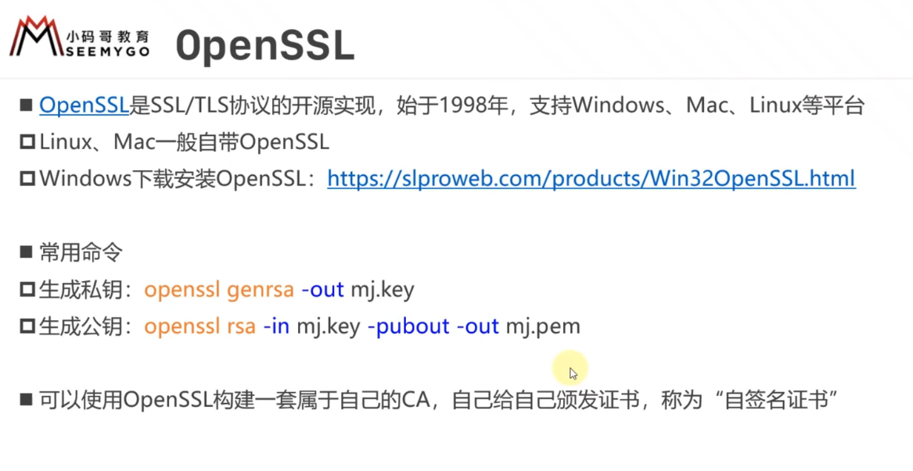
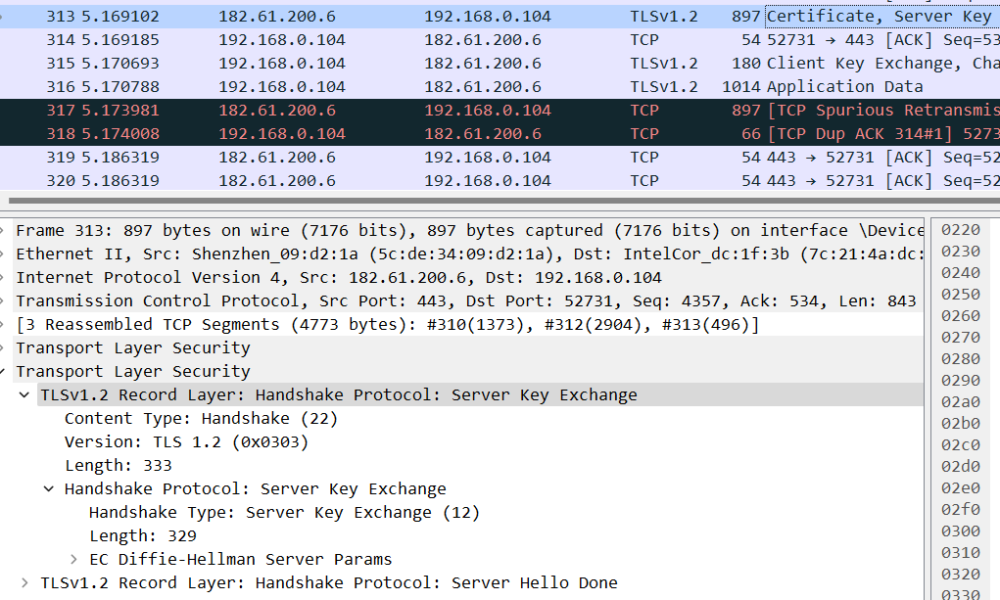
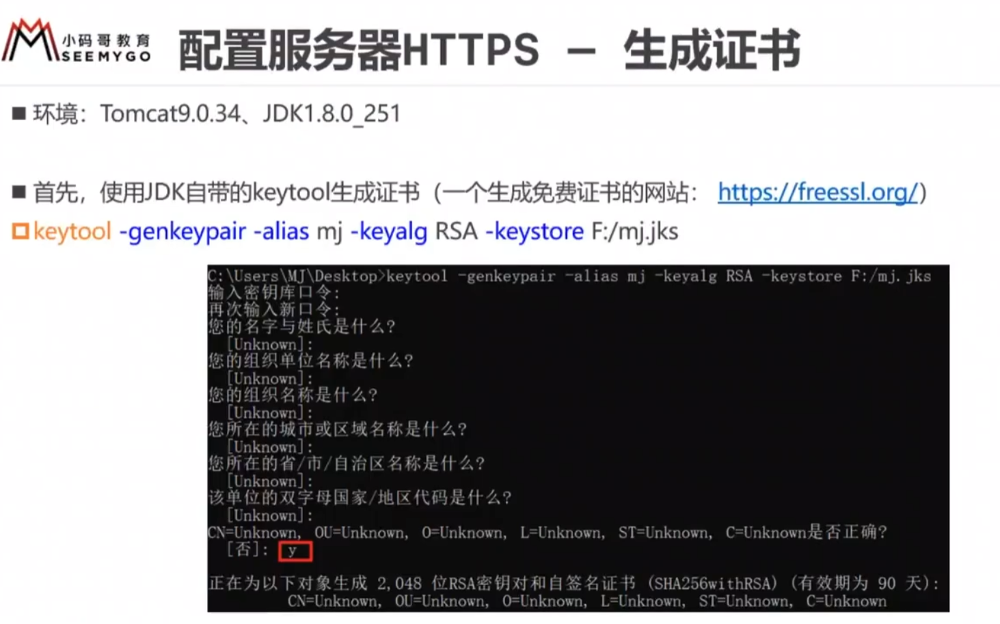

## 1.HTTPS

### 1.1概述

协议的默认端口是指服务器的

### 1.2SSL/TLS

HTTPS使用SSL/TLS对整个报文进行加密

​	SSL（Secure Sockets Layer）是一种用于在计算机网络上实现安全通信的协议。SSL 最初由 Netscape 开发，后来演化为 TLS（Transport Layer Security），因此更常见的术语是 TLS。

​	TLS/SSL 协议的主要目标是确保在通信双方之间传输的数据的机密性、完整性和真实性。这些协议在互联网上广泛用于保护敏感数据的传输，如登录凭据、信用卡信息和个人数据等。以下是 TLS/SSL 的主要特点和工作原理：

1. **数据加密：** TLS/SSL 使用加密算法来保护数据的机密性。在通信的两端之间建立连接后，数据在传输过程中被加密，以防止中间人攻击者窃取敏感信息。
2. **数据完整性：** TLS/SSL 使用哈希函数和数字签名来验证数据的完整性。接收方可以确保接收到的数据没有被篡改或损坏。
3. **身份验证：** TLS/SSL 协议允许服务器和客户端进行身份验证。服务器通常需要提供一个数字证书，以证明其身份。客户端可以验证服务器的证书，确保其连接到了正确的服务器。另外，客户端身份验证也可以通过证书完成。
4. **握手过程：** TLS/SSL 握手过程用于建立安全连接。在握手期间，通信双方交换加密密钥和协商加密算法。这确保了双方都使用相同的密钥来加密和解密数据。
5. **版本和协议：** TLS/SSL 有不同的版本（如 TLS 1.0、TLS 1.1、TLS 1.2、TLS 1.3 等），每个版本都有不同的安全性和功能。通信双方必须协商选择一个共同支持的版本。
6. **端口号：** TLS/SSL 通常运行在不同的端口上，例如 HTTPS（安全的 HTTP）使用的默认端口号是 443。

​	TLS/SSL 协议已广泛用于保护互联网上的敏感信息，特别是在网上购物、网银、电子邮件通信等领域。通过使用 TLS/SSL，数据在传输过程中得到了保护，从而确保了用户和服务器之间的通信是安全的。这些协议的安全性不断得到改进，以应对不断发展的网络安全威胁。

### 1.3OpenSSL

### 1.4成本

### 1.5通信过程

#### 1.5.1概述

#### 1.5.2 TLS 1.2的连接

TLS版本、加密套件、其他

##### ①

发送Client Hello，服务器会给ACK确认

##### ②

##### ③

##### ④

##### ⑤

验证证书的真实有效性

##### ⑥

根据三个密钥串，生成会话密钥

密钥交换算法，不传输密钥，像TLS就是根据三个密钥串，各自生成同一个主密钥，加密消息

##### ⑦

**告知服务器之后的通信采用会话密钥进行加密，后面传输的HTTP请求采用会话密钥进行加密**

##### ⑧

用主密钥生成的客户端会话密钥加密摘要值，发给服务器，考验服务器能否正确解密

##### ⑨、⑩

传输的HTTP请求采用会话密钥进行加密

用主密钥生成的服务端会话密钥加密摘要值，发给客户端，考验客户端能否正确解密

**客户端服务器都要验证加密解密没问题，对称的过程**

**后续双方传输的数据都是加密的**

TLS在应用层和传输层之间对数据进行加密和解密，不应当思考用哪种协议传输数据，TLS只不过是在TCP层之上，本质一样

HTTPS请求中使用的是**TCP**（Transmission Control Protocol）**和TLS**（Transport Layer Security）**两者共同传输数据**

1. TCP传输：在建立HTTPS连接之前，首先使用TCP建立连接。TCP是一种可靠的传输协议，它确保数据在客户端和服务器之间的可靠传输。**一旦建立TCP连接，数据可以在客户端和服务器之间通过TCP进行传输**。
2. TLS加密：HTTPS的"Secure"部分来自TLS（或其先前版本称为SSL）协议。**TLS在已建立的TCP连接上添加了一个加密层**。这个加密层负责对HTTP请求和响应中的数据进行加密和解密。TLS使用数字证书和加密算法来确保数据的机密性和完整性，从而提供了安全的数据传输。

所以，**HTTPS请求首先建立TCP连接，然后在这个连接上使用TLS来加密和保护数据传输，从而实现安全的通信**。这种组合允许客户端和服务器之间的数据传输既可靠又安全。

## 2.HTTPS与HTTP的区别

HTTP（Hypertext Transfer Protocol）和 HTTPS（HTTP Secure）是两种用于在Web上传输数据的协议，它们之间的主要区别在于安全性：

1. **安全性：**
   - **HTTP：** HTTP是一种不安全的协议，**数据在传输过程中是明文传输的，容易被中间人窃听和篡改**。因此，HTTP不适合传输敏感信息，如信用卡号码或登录凭据。
   - **HTTPS：** **HTTPS是HTTP的安全版本，它使用TLS/SSL（Transport Layer Security/Secure Sockets Layer）协议对数据进行加密和身份验证。这使得数据在传输过程中被加密，从而更难以被窃听或篡改。**因此，HTTPS适用于需要保护隐私和安全性的数据传输，如在线支付和登录。
2. **协议标识：**
   - **HTTP：** HTTP使用默认端口80（对于非加密连接）或8080（对于一些代理配置）。
   - **HTTPS：** HTTPS使用默认端口443，通常在URL中以"https://"开头。
3. **加密：**
   - **HTTP：** HTTP不提供数据加密，数据以纯文本形式传输。
   - **HTTPS：** HTTPS使用TLS/SSL协议来加密数据，确保数据在传输过程中的机密性。
4. **证书：**
   - **HTTP：** HTTP不涉及数字证书或服务器身份验证。
   - **HTTPS：** HTTPS使用数字证书来验证服务器的身份。浏览器会检查服务器的证书是否由受信任的证书颁发机构（CA）签发，以确保连接的安全性和服务器的合法性。
5. **速度：**
   - **HTTP：** 由于不涉及加密和握手过程，HTTP通常比HTTPS更快速，适用于不涉及敏感信息的普通网页浏览。
   - **HTTPS：** 由于加密和握手过程的开销，HTTPS可能会略微降低页面加载速度。然而，现代的计算能力和优化使得这种差异通常不太明显。

总之，HTTPS是HTTP的安全版本，通过使用加密和数字证书来提高数据传输的安全性和隐私保护。因此，在需要保护敏感信息的情况下，使用HTTPS是非常重要的。大多数现代网站都采用了HTTPS来保护用户数据和隐私。

## 3.Wireshark解密HTTPS

## 4.配置服务器HTTPS

