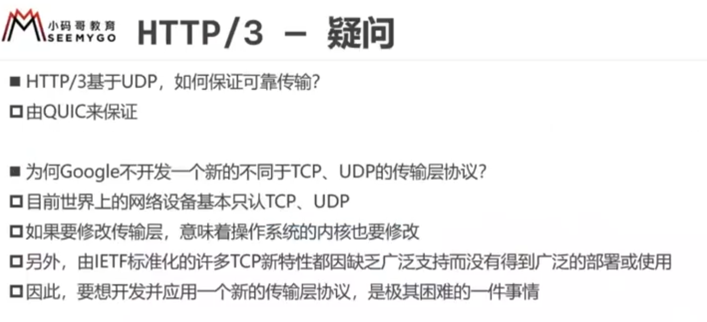

## 1.HTTP/1.1的不足

HTTP/1.1版本包括HTTP和HTTPS 

同一时间，一个连接只能对应一个请求，其他请求要排队等待

只允许客户端主动发起请求，一个请求只能对应一个响应，服务器无法一次性返回多条数据，请求-应答模式

## 2.SPDY

## 3.HTTP2

### 3.1概述

HTTP2，相当于把HTTP/1.1和SPDY合并了

SPDY强制要求使用SSL/TLS，HTTP2的RFC文档里未强制要求使用SSL/TLS

虽然HTTP2本身不强求，但现在一般都会使用SSL/TLS，速度提高很大，安全层响应不成问题（HTTP2的HTTPS）

HTTP/1.1，浏览器允许同时最多6个并发连接

HTTP2，只有一个连接

### 3.2二进制格式

### 3.3基本概念

所以通信都在一个TCP连接上完成，此连接可以承载任意数量的双向数据流

### 3.4多路复用  

### 3.5优先级

### 3.6头部压缩

会跟踪请求头，相同的内容不再发送

索引表里有的，只发索引号

### 3.7服务器推送

### 3.8问题

#### 3.8.1队头阻塞

SPDY，一但有个数据包丢失了，由于TCP是按照顺序拿包，之后的包就无法拿到了

QUIC，是通过UDP传输，即使丢包后，会重新发包，给到接收端

#### 3.8.2握手延迟

### 3.9优势

HTTP/2相对于HTTP/1.1引入了许多改进，旨在提高性能、安全性和效率。以下是HTTP/2相对于HTTP/1.1的主要改进：

1. **多路复用（Multiplexing）：** HTTP/2引入了多路复用，允许在单个TCP连接上同时发送多个数据流。这意味着可以并行发送多个请求和响应，而不需要等待一个请求完成才能发送下一个。这有助于减少延迟，提高页面加载速度。
2. **头部压缩（Header Compression）：** HTTP/2使用HPACK压缩算法对请求和响应头部进行压缩，减少了头部数据的传输量。这降低了网络带宽的需求，特别是对于包含大量Cookie和头部字段的请求。
3. **优先级和依赖关系（Prioritization and Dependency）：** HTTP/2允许发送方为不同的数据流设置优先级，以确保重要的资源被首先处理。还可以定义依赖关系，以确保某些数据流在其他数据流之前完成。
4. **流量控制（Flow Control）：** HTTP/2支持流量控制，允许发送方和接收方控制每个数据流的数据传输速率，以避免拥塞和过载。
5. **服务器推送（Server Push）：** HTTP/2允许服务器在客户端请求之前主动推送相关资源，从而减少了往返请求的数量。这可以提高页面加载速度。
6. **二进制协议（Binary Protocol）：** HTTP/2采用了二进制帧的格式，与HTTP/1.1的文本协议相比，更加紧凑和高效。这降低了处理数据的复杂性。
7. **头部和数据分离（Header and Data Separation）：** 在HTTP/2中，请求和响应的头部和数据可以独立发送和接收，而不必等待整个请求或响应完全可用。
8. **连接复用（Connection Multiplexing）：** HTTP/2允许多个请求和响应同时共享同一个TCP连接，减少了连接建立和断开的开销，提高了效率。

总体而言，HTTP/2的目标是提供更快、更高效的Web性能，减少了HTTP/1.1中存在的一些限制和性能瓶颈。这些改进使得HTTP/2成为了现代Web应用程序的重要协议之一。然而，需要注意的是，HTTP/2的部署和使用可能需要服务器和客户端的支持，但它为Web性能带来了显著的提升。

## 4.HTTP3

### 4.1概述

HTTP3解决了队头阻塞和握手延迟问题

QUIC解决UDP的可靠传输问题

### 4.2疑问

双方的QUIC层保证可靠传输

### 4.3特性

### 4.4问题

