## 1.WebSocket

### 1.1概述

只需发一次请求建立连接即可

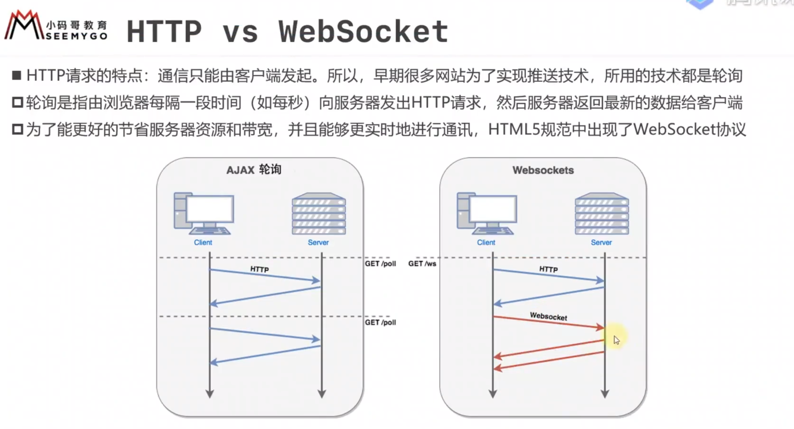

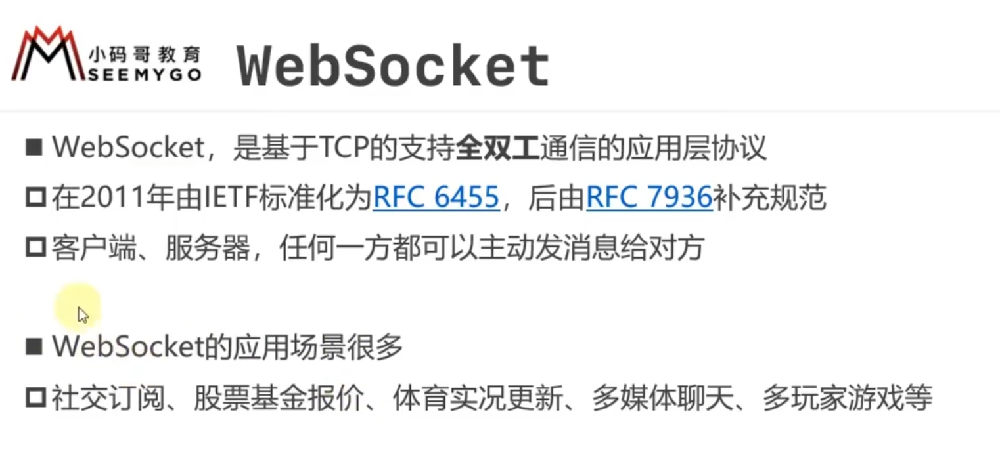

WebSocket不仅传输层会建立连接，应用层也会建立连接，而HTTP在应用层没有这个概念

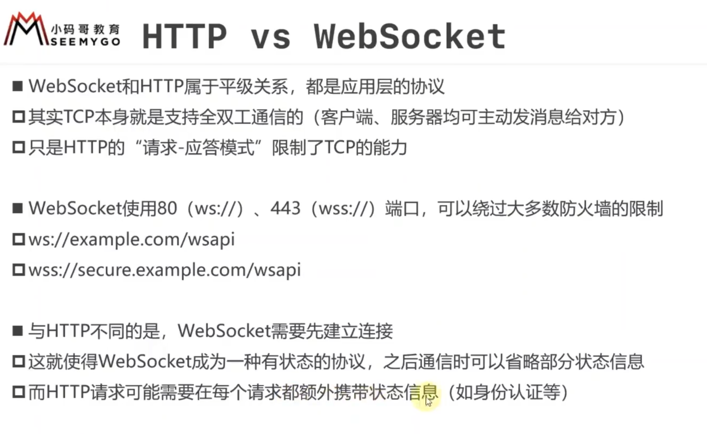

### 1.2建立连接

WebSocket建立连接其实就是HTTP升级请求

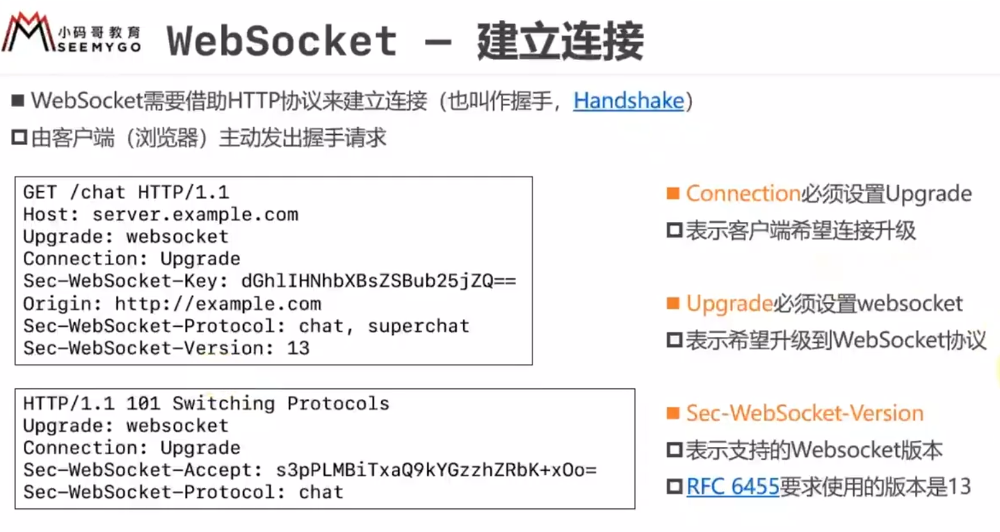

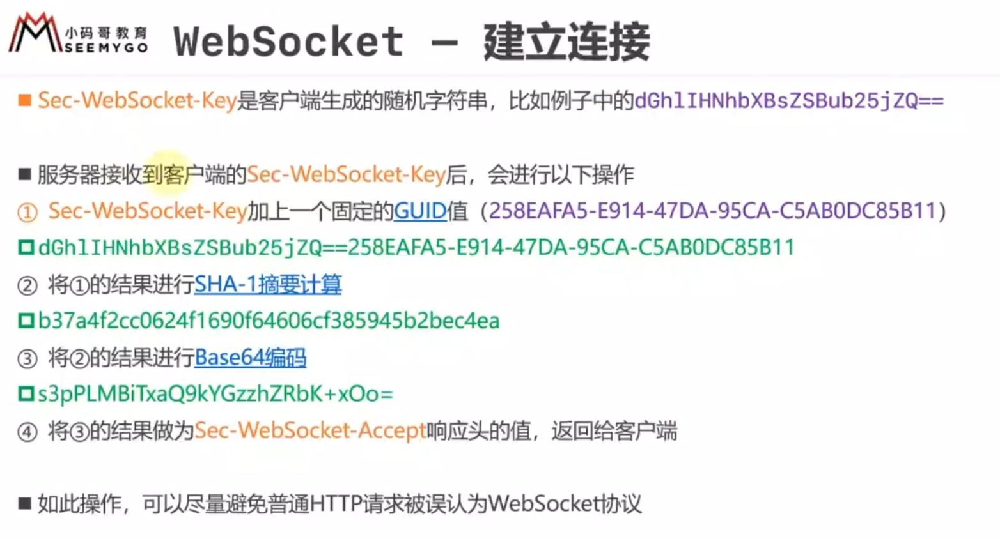

### 1.3使用

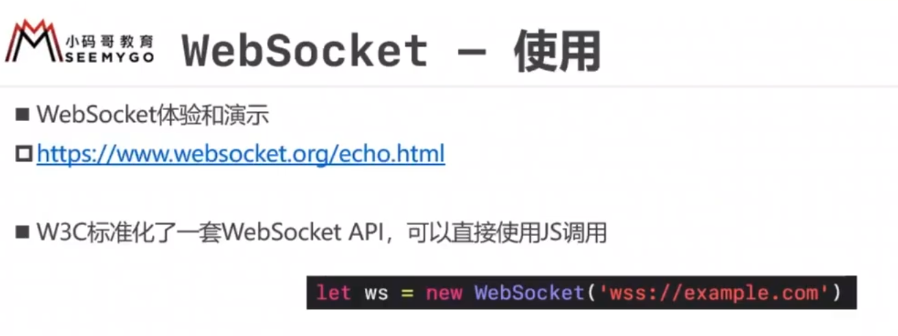

##  2.WebService

是一种开放数据的标准，想开放的平台就要去遵守的标准

有的平台想将自己的数据公开，要遵循一定的标准，遵守SOAP协议，规定请求和响应里XML文档该怎么写

访问者要传相应的SOAP请求，才能得到响应

 如果想看提供的接口，需要访问WSDL

但现在WebService完全可以用HTTP+JSON取代

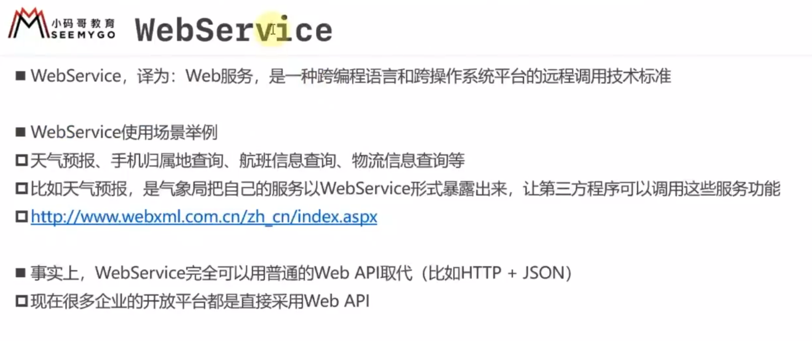

WSDL用来获取接口的内容格式（说明书）

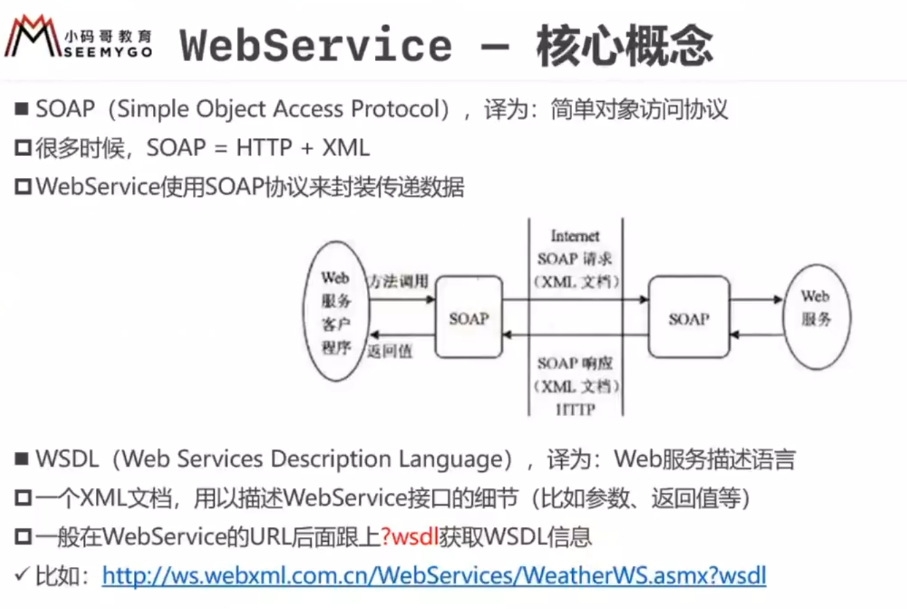

## 3.RESTful

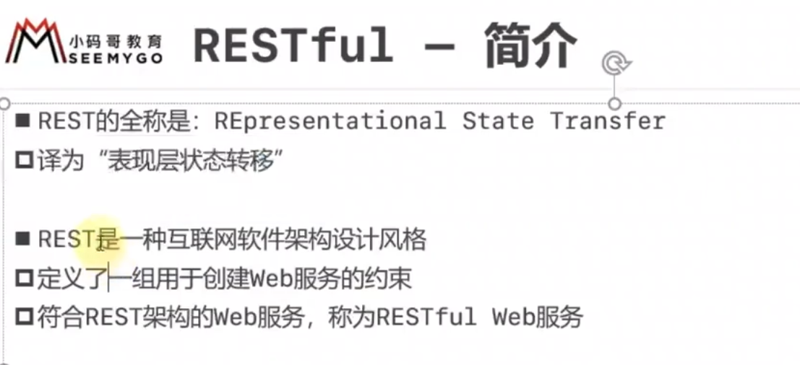

URL中使用名词（建议用复数形式），用HTTP的方法表达动作 

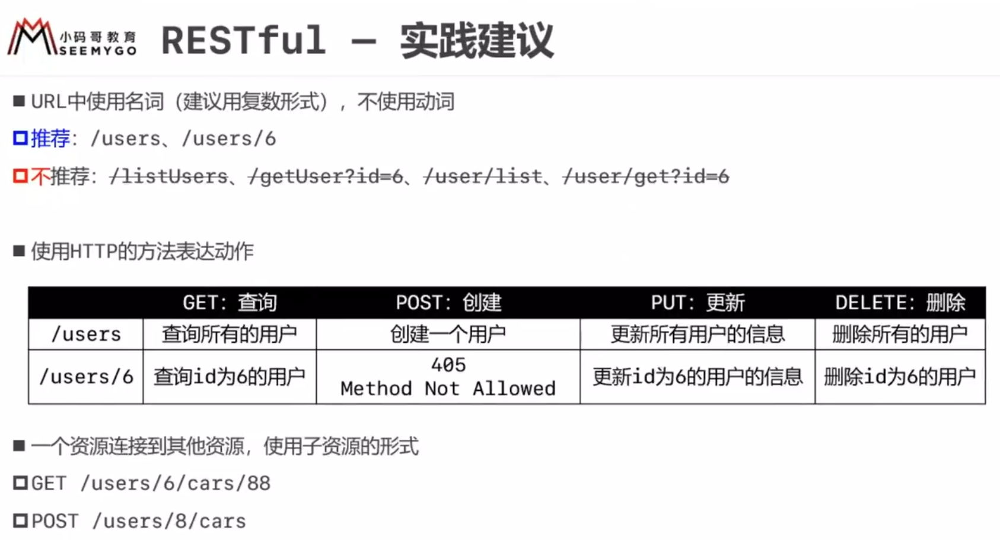

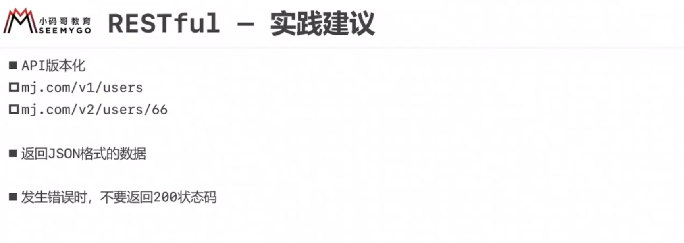

## 4.HTTPDNS

网页的话，用的是浏览器内部配置的操作系统的DNS，而移动开发是自己写客户端，所以常用在移动开发、桌面应用开发中

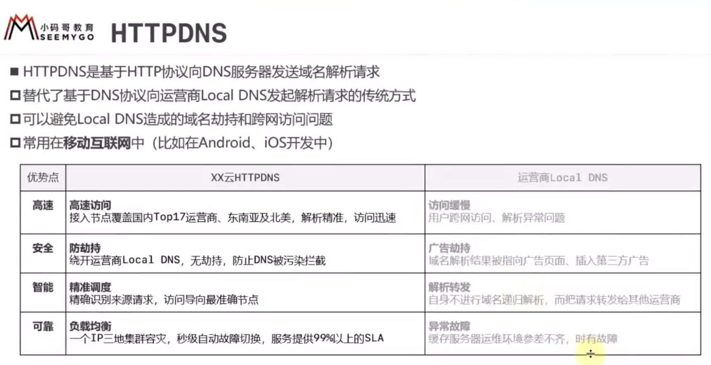

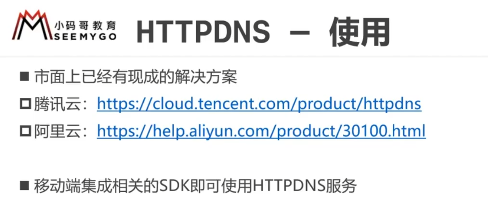

## 5.FTP

FTP相比HTTP，在传输文件方面更有优势

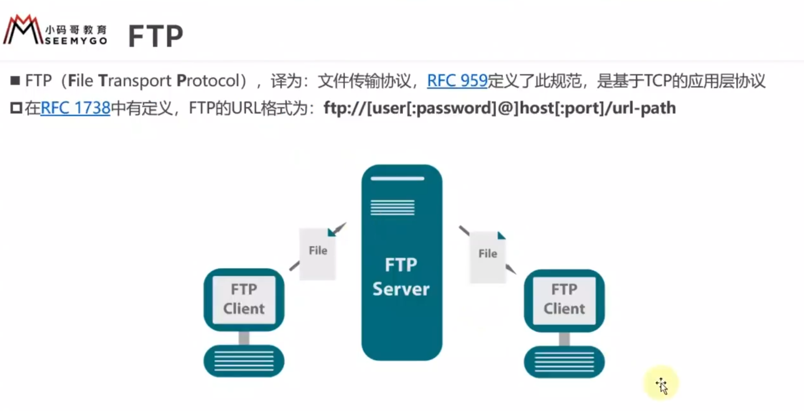

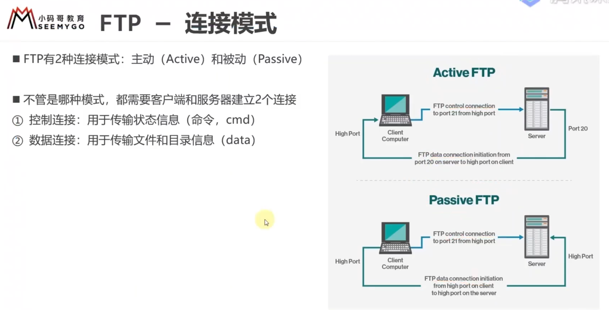

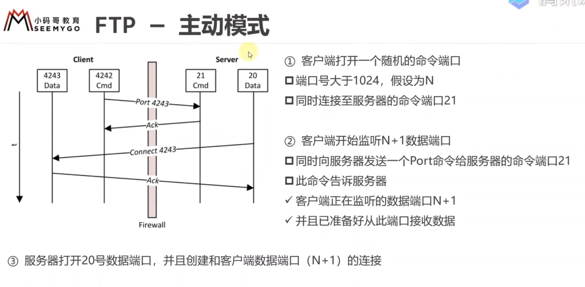

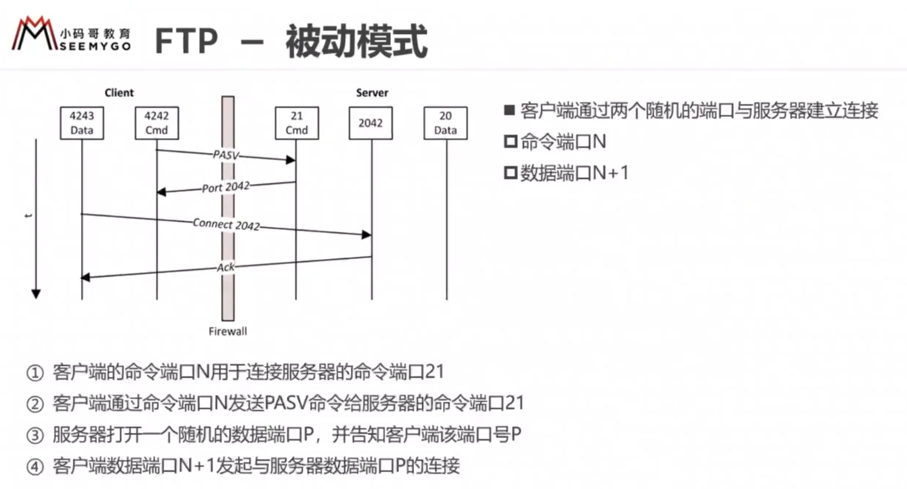

## 6.邮件

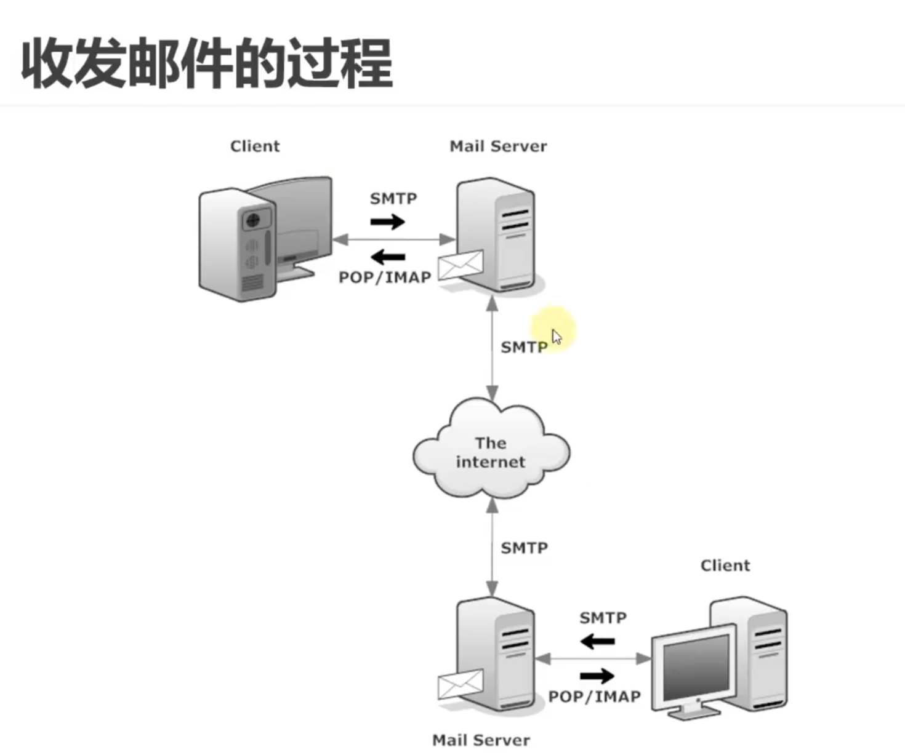

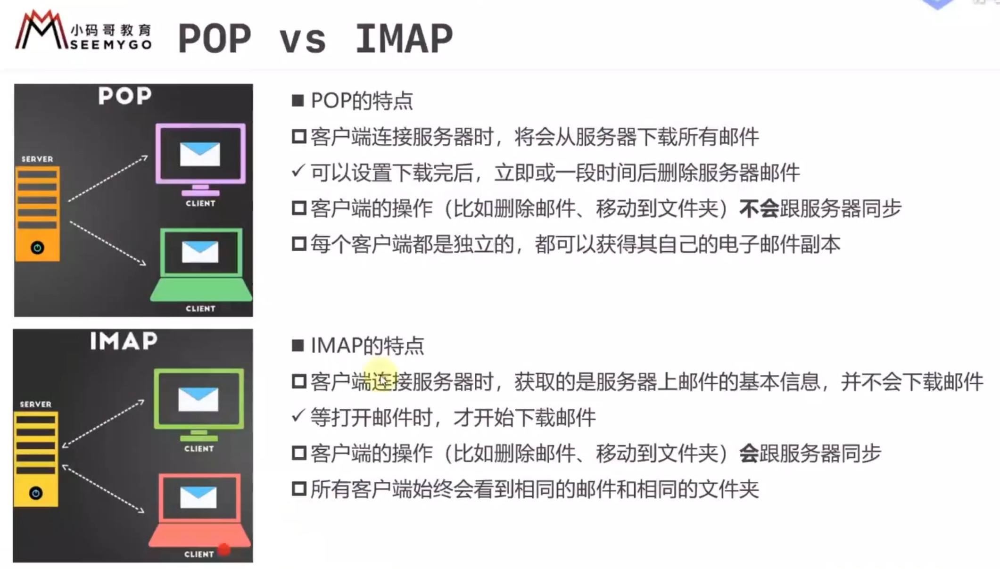