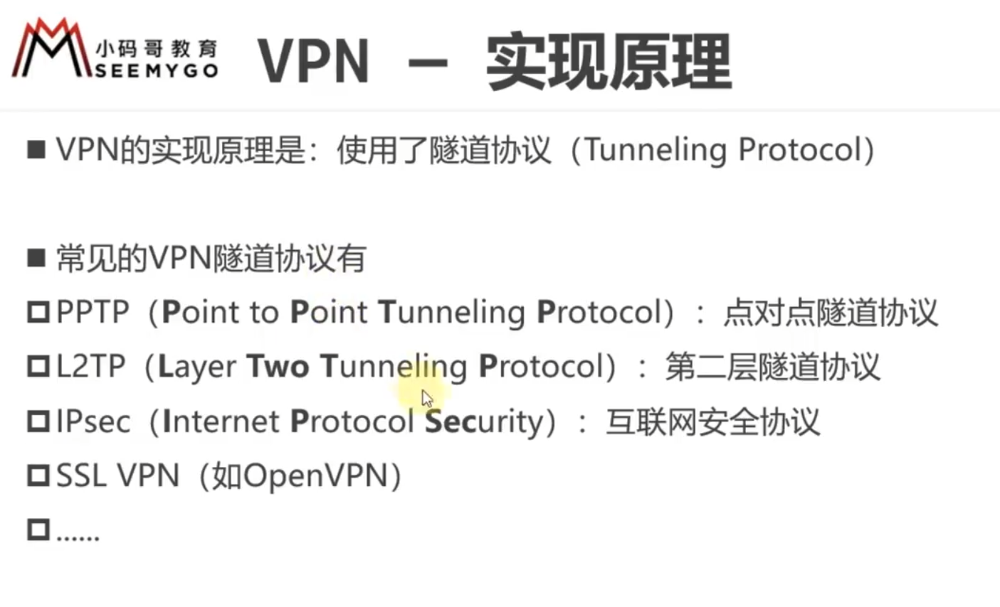
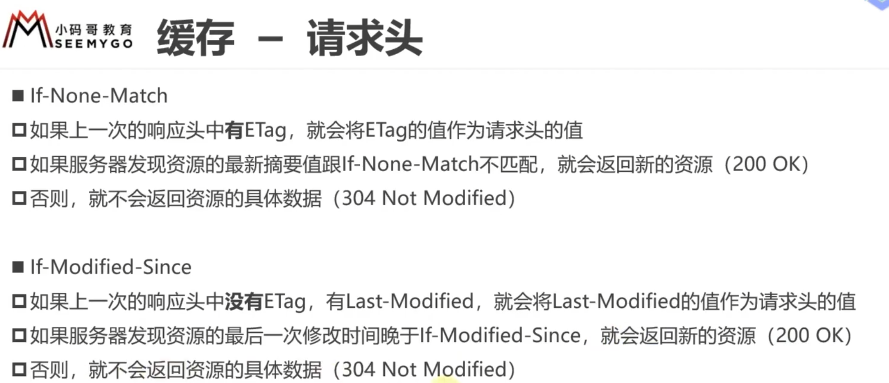
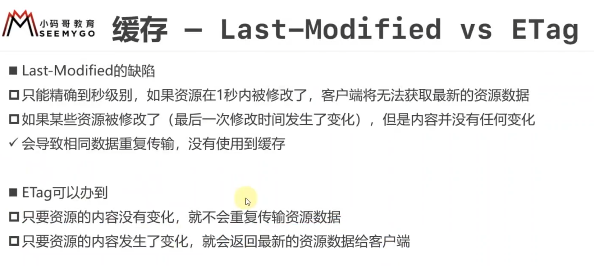
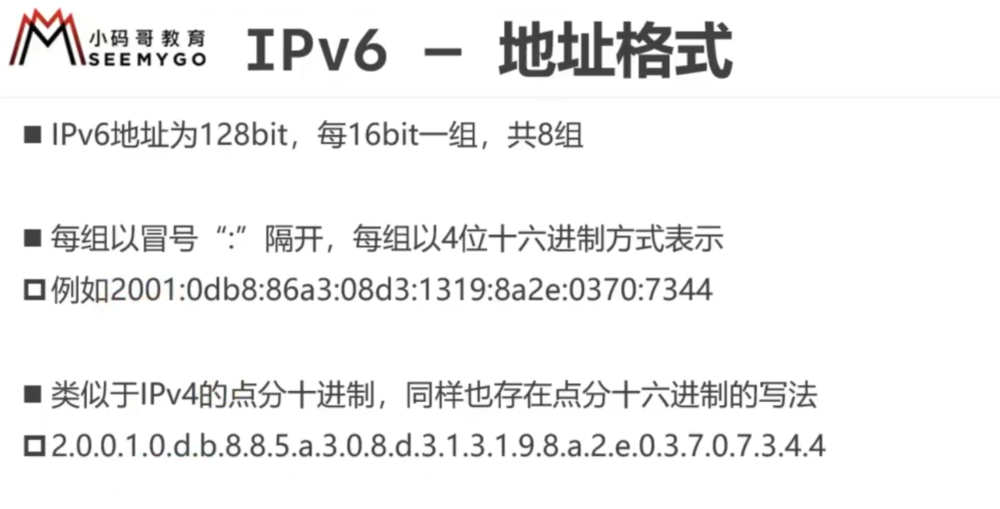
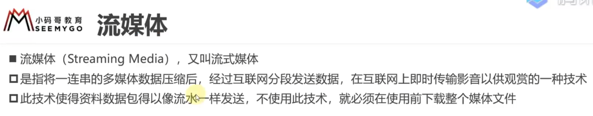
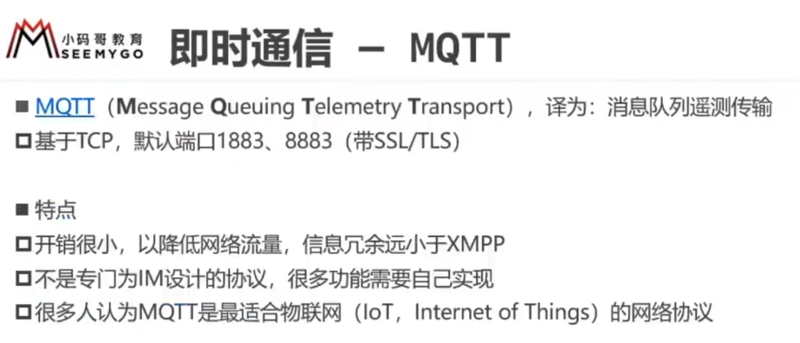

## 1.VPN

### 1.1概述

对发送的流量进行加密（不管啥协议），防止被拦截

### 1.2作用

"Great Firewall of China"（中国的“防火长城”）是指中国政府用来控制和审查互联网内容的复杂系统。这个系统的正式名称是“金盾工程”，由中国政府的公安部运营。它旨在对中国境内的互联网信息进行审查和限制，以符合政府的审查要求和控制。

中国的“防火长城”采用各种方法来控制互联网内容和在线活动，包括以下几个方面：

1. **网站封锁**：政府封锁了许多外国网站和平台，包括像Facebook、Twitter和YouTube等热门社交媒体，以及批评中国政府的新闻网站。
2. **关键词过滤**：在互联网搜索和社交媒体平台上，过滤和屏蔽了一些关键词和短语，以防止政治敏感信息和讨论的传播。
3. **DNS过滤**：通过操纵域名系统（DNS），阻止用户访问带有被禁内容的网站。
4. **IP地址封锁**：封锁了与外国网站和服务相关的一些IP地址。
5. **内容过滤**：采用内容过滤技术来监控和审查互联网上的内容，以确保它们符合政府的审查标准。
6. **实名制要求**：中国政府要求互联网用户使用真实身份信息注册和登录互联网服务，以便对他们的活动进行监控和追踪。
7. **互联网服务提供商协助**：互联网服务提供商（ISPs）和网站必须遵守政府的规定，协助实施审查和封锁。

“防火长城”旨在维护政府的信息控制和审查权，并限制中国境内的公民和网民访问国际互联网上的开放信息和平台。这对于中国政府来说是一种信息控制手段，以确保网络上的内容和信息不会影响政权的稳定和权威。然而，它也受到国际社会的广泛关注和批评，因为它限制了中国公民的言论自由和访问信息的权利。

### 1.3与代理的区别

需要在设备上安装VPN软件，保证从客户端出去的流量就是加密后的流量

### 1.4实现原理

## 2.网络爬虫

从一个网页中爬取包含的多个网页，结构如同蜘蛛网一样，故也叫网络蜘蛛

## 3.无线网络

蜂窝网络

用无线AP去散播无线信号，跟设备建立无线连接

## 4.缓存

### 4.1概述

Ctrl+F5 强制刷新缓存，忽略缓存，再次发请求给服务器

缓存位置：

1. disk cache 磁盘缓存
2. memory cache 内存缓存

### 4.2响应头

缓存在有效时间内，获取该资源，会直接从缓存中获取，过了有效时间后，再发请求给服务器，服务器会根据这次请求携带的信息跟这个文件最新的状态进行比对，如果文件没有任何变化，就会给回304，让他用缓存的东西，如果发生变化，给回200，返回最新的数据

Cache-Control设置为no-cache，即使未过有效时间，只要要用缓存，就要向服务器发请求询问缓存是否有变化，再决定如何使用

判断文件是否变化的字段

### 4.3请求头

### 4.4使用流程

## 5.IPv6

### 5.1概述

### 5.2地址格式

### 5.3首部格式

## 6.流媒体

## 7.即时通讯

