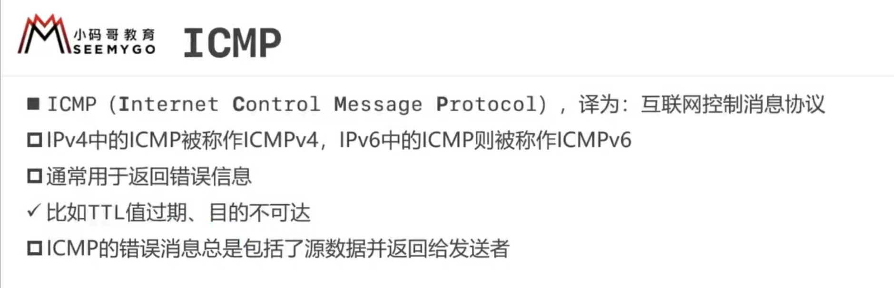

## 1. MAC地址

### 1.1概述

### 1.2表示格式

### 1.3操作

有时可以通过修改mac地址蹭网（学校机房）

### 1.4获取 

## 2. IP地址

### 2.1 概念

### 2.2 组成

计算机通信前，先通过ip地址和子网掩码判断是否在同一网段

子网掩码全为1的部分为网络ID，全为0的部分为主机ID 

网络ID为130.168，主机ID为1.10，总共有（256*256-2）个主机ID

130.168.0.0表示网段，130.168.255.255表示广播ip地址，表示给该网段所有主机发信息

130.168.1为网络ID，10为主机ID，网段为130.168.1.0，总共有254个主机ID

### 2.3 分类

主机ID全为1，192.168.1.255表示广播ip地址

C类地址：网络ID以110开头

用ping给某个网段全部主机发数据 

## 3.子网掩码

### 3.1 CIDR表示方法

子网掩码跟类网络没啥关系， 如10.172.168.1/24仍是A类地址

### 3.2子网划分

#### 3.2.1划分原因

#### 3.2.2概念

子网不在同一网段

#### 3.2.3等长子网划分

主机部分全为0或全为1不可用 （0-127）->（1-126）、（128-255）->（129-254）

A子网网段为192.168.0.0/25，网络ID192.168.0.0

B子网网段为192.168.0.128/25，网络ID192.168.0.128

子网掩码都为：255.255.255.128

每个子网都有自己的网络ID、网段和可用主机范围

#### 3.2.4变长子网划分

左边主机只知道右边主机的ip，不知道子网掩码，会用自己的子网掩码跟它的ip来算网段

左边计算右边网段为192.168.10.0，不在同一网段，右边计算左边网段为192.168.0.0，网段相同，会发送，但无法拿到

网络要通的话，双方都要通

## 4.常见概念

### 4.1.因特网

因特网（Internet）是一个由全球范围内的计算机网络所组成的基础设施，允许连接数十亿台设备，以便它们能够互相通信和交换数据。它是一个集成了多种通信技术、协议和服务的网络，为人们提供了广泛的信息获取、交流、娱乐和商业机会。

以下是因特网的一些关键概念：

1.  **分布式网络：** 因特网是一个分布式网络，由多个互相连接的网络组成。这些网络可以涵盖不同的地理位置，由不同的组织和提供商管理。

2.  **协议：** 因特网通信依赖于一系列协议，这些协议定义了数据如何在网络中传输、交换和处理。其中最重要的是TCP/IP协议，它规定了数据传输的规则。

3.  **IP地址：** 每个连接到因特网的设备都被分配了一个唯一的IP地址，这个地址用于标识设备在网络上的位置。IPv4和IPv6是两种常用的IP地址版本。

4.  **URL和域名：** 统一资源定位器（URL）是用于定位互联网上资源（如网页、图片、视频）的地址。域名是URL的一部分，用于人们更容易记住网站的名称，比如www.example.com。

5.  **浏览器：** 网页浏览器是一种应用程序，用于向用户呈现网页内容，通过HTTP协议从服务器上获取网页，并将其显示在用户的屏幕上。

6.  **网页和网站：** 网页是互联网上的文档，可以包含文字、图像、视频和其他媒体。网站是由多个网页组成的集合，形成一个有组织的网络空间。

7.  **电子邮件：** 电子邮件是一种数字通信方式，允许用户在全球范围内发送和接收消息、文件和多媒体内容。

8.  **搜索引擎：** 搜索引擎允许用户通过输入关键词来搜索互联网上的信息，它会返回与关键词相关的网页列表。

9.  **社交媒体：** 社交媒体平台允许用户在线建立个人资料、共享内容，以及与其他用户互动。

10.  **云计算：** 云计算提供基于网络的计算、存储和应用服务，使用户能够在互联网上使用资源，而不需要直接拥有物理硬件。

这些概念共同构成了因特网的基础，它已经成为现代社会中重要的通信和信息交流平台。

### 4.2以太网

以太网（Ethernet）是一种常见的局域网（LAN）技术，用于在局限的范围内（例如家庭、办公室或校园）连接多台计算机和设备，以实现数据通信和共享资源。它是计算机网络中最常见、应用最广泛的一种通信技术。

以下是关于以太网的一些重要概念：

1.  **拓扑结构：** 以太网可以采用不同的拓扑结构，包括星型、总线型、环形和树状。其中，星型拓扑是最常见的，所有设备都连接到一个集线器、交换机或路由器。

2.  **帧（Frame）：** 数据在以太网中通过帧的形式传输。帧是数据包的基本单位，它包含了源地址、目标地址、数据和校验等信息。

3.  **MAC地址：** 每台连接到以太网的设备都有一个唯一的媒体访问控制（MAC）地址，用于在局域网内识别设备。MAC地址是一个由十六进制数字组成的地址。

4.  **CSMA/CD：** 以太网使用“载波监听多路访问/冲突检测”（CSMA/CD）协议来控制设备之间的数据传输。在发送数据之前，设备会检测是否有其他设备正在传输数据，以避免碰撞。

5.  **速率和标准：** 以太网有不同的速率和标准，例如10 Mbps（传统的以太网）、100 Mbps（快速以太网）、1 Gbps（千兆以太网）、10 Gbps（十千兆以太网）等。这些标准决定了数据传输的速率和规范。

6.  **交换机（Switch）：** 交换机是一种网络设备，用于在局域网内管理数据传输。与集线器不同，交换机能够识别设备的MAC地址，并根据需要将数据仅发送到特定的目标设备，提高了网络性能和效率。

7.  **协议：** 以太网使用一系列协议来确保数据传输的准确性和可靠性。例如，以太网帧校验序列（FCS）用于检测传输过程中是否出现错误。

8.  **半双工和全双工：** 以太网可以在半双工或全双工模式下运行。在半双工模式下，设备不能同时发送和接收数据；在全双工模式下，设备可以同时进行发送和接收。

以太网技术的灵活性和广泛应用使其成为许多局域网的基础，使设备能够在本地范围内高效地共享信息和资源。

### 4.3.家庭网络连接因特网步骤

家庭网络通常通过路由器连接到因特网。以下是连接过程的一般步骤：

1.  **获取一个宽带连接**：您需要从互联网服务提供商（ISP）订购一个宽带互联网连接，如光纤、电缆、DSL等。ISP会提供您一个网络接入方式，通常是通过光纤、电缆调制解调器（CM）或数字用户线路（DSL）调制解调器。

2.  **选择合适的路由器**：选择一个适合您家庭需求的路由器。您可以选择普通的家用路由器，也可以选择一些高级功能的路由器，如双频无线网络、QoS（服务质量）控制等。

3.  **连接调制解调器和路由器**：将ISP提供的调制解调器与路由器连接。通常，您需要使用一个以太网电缆将调制解调器的一个端口连接到路由器的“WAN”或“Internet”端口。这样，调制解调器将通过物理连接将因特网信号传送到路由器。

4.  **连接其他设备**：将您的电脑、手机、平板电脑等设备连接到路由器的无线网络或以太网端口。通过无线连接或有线连接，这些设备就可以与路由器通信，从而访问因特网。

5.  **配置路由器设置**：大多数路由器在首次设置时需要进行一些基本配置。这可能包括为您的网络设置一个名称（SSID）、设置无线密码、可能的话更新路由器的固件等。您可以通过连接到路由器的管理员界面（通常在网页浏览器中输入路由器的IP地址，如192.168.1.1）来完成这些设置。

6.  **连接到因特网**：一旦路由器进行了正确的配置，它将自动与调制解调器建立连接，并从ISP获取因特网IP地址。您的连接设备现在应该能够通过路由器访问因特网。

需要注意的是，这只是一个基本的连接过程概述。实际情况可能因您的ISP、路由器型号和个人需求而有所不同。如果您在设置过程中遇到问题，您可以查阅您所使用的路由器型号的用户手册，或者联系ISP的客户支持寻求帮助。

路由器上的网关是指在局域网（LAN）与广域网（WAN）之间充当连接点的设备或网络节点。它是将来自局域网内部设备的数据流量路由到互联网上的设备的关键组件。通常情况下，路由器本身就是网关，它处理网络流量的转发、路由和管理。

### 4.4.路由器上的网关

以下是关于路由器上网关的一些重要信息：

1. **数据转发：** 路由器上的网关负责在局域网和互联网之间传递数据。当局域网内的设备发送请求或数据包时，路由器会根据目标地址决定将数据包发送到何处。
2. **网络地址转换（NAT）：** 在家庭或办公网络中，路由器的网关通常会执行网络地址转换。这意味着局域网内的多个设备共享一个公共IP地址，而路由器会在发送数据时将数据包的源地址转换为路由器的公共IP地址，以便数据包在互联网上传输。
3. **路由表：** 路由器内部有一个路由表，其中记录了不同目标网络的路径信息。当数据包到达路由器，路由器会查阅路由表以确定将数据包发送到哪个方向。
4. **默认网关：** 在局域网中，通常有一个特定的路由器被配置为默认网关。当局域网内的设备要发送数据到不在同一子网中的目标地址时，数据包将被发送到默认网关，由其处理转发到外部网络。
5. **防火墙：** 路由器通常还具有防火墙功能，用于监控和控制数据流量，以保护局域网免受潜在的安全威胁。
6. **公共和私有网络：** 路由器上的网关将局域网与公共互联网分隔开来。局域网内的设备可以使用私有IP地址，而网关负责在与公共互联网通信时将这些地址转换为公共IP地址。
7. **配置和管理：** 路由器上的网关需要根据特定网络的需求进行配置。这包括指定局域网和互联网的IP地址、子网掩码、网关地址等。

总之，路由器上的网关是连接局域网与互联网之间的关键设备，它在网络层次结构中起到了路由和数据转发的重要角色，同时还承担了网络地址转换和安全防护的功能。

### 4.5网卡

网卡是用来收发数据的 ，如果传来的数据超过网卡能处理的带宽（负荷），数据就可能被丢掉，例如，路由器忙不过来，会丢包

作用：

1. 对数据包的检验，目标mac地址是否正确
2. 带宽（百兆网卡，千兆网卡），网卡的传输速度

网卡，也称为网络适配器、网络接口卡或以太网卡，是一种用于在计算机和其他设备之间传输数据的硬件组件。它是连接计算机到局域网（LAN）、广域网（WAN）或互联网的关键组件之一。网卡的主要功能是将计算机中的数据转换成可以通过网络传输的信号，并将接收到的网络数据转换成计算机可读的格式。

以下是网卡的一些基本概念：

1. **物理接口**：网卡通常具有一个物理接口，用于连接计算机到网络。这可以是以太网端口（通常是RJ-45接口）或其他类型的接口，如无线网卡中的Wi-Fi接口。
2. **MAC地址**：每个网卡都有一个唯一的媒体访问控制（MAC）地址，它是一个由数字和字母组成的标识符。MAC地址用于在局域网内唯一标识设备，以便数据可以正确发送到目标设备。
3. **数据包处理**：网卡负责将数据转换成数据包，并将其发送到网络。它还能够接收来自网络的数据包，并将其解析为计算机可读的数据。
4. **驱动程序**：为了使操作系统能够与网卡进行通信，需要安装相应的网卡驱动程序。驱动程序是软件，它允许操作系统与网卡进行交互，并控制数据在物理媒介和计算机内部的流动。
5. **速率和协议支持**：不同的网卡可能支持不同的传输速率和网络通信协议。例如，以太网卡可以支持不同的传输速率，如千兆以太网（Gigabit Ethernet）或万兆以太网（10 Gigabit Ethernet），并且可以支持各种网络协议。
6. **无线网卡**：无线网卡是一种特殊类型的网卡，它通过Wi-Fi连接到无线网络。它允许设备通过无线信号与网络通信，而无需物理连接。

总之，网卡是计算机网络中的关键组件，它使计算机能够与其他设备进行数据通信，从而实现互联网和局域网等网络的连接。

### 4.6带宽

带宽（Bandwidth）是一个用于描述网络或通信系统性能的重要概念，它表示一个网络连接或通信通道能够传输数据的速率或容量。带宽通常以位每秒（bps）或其更大的倍数（如千兆位每秒，兆位每秒或千兆位每秒）来衡量。

带宽的含义包括以下几个方面：

1. **数据传输速率**：带宽表示一个通信链路或网络连接每秒能够传输的最大数据量。例如，如果一个互联网连接的带宽为100兆位每秒（100 Mbps），则它每秒最多能够传输100兆位的数据。
2. **频率范围**：在信号处理和电子通信中，带宽也可以指信号的频率范围。在这个上下文中，带宽表示信号中包含的频率范围，通常以赫兹（Hz）表示。
3. **网络连接容量**：带宽还表示网络中的连接或通信通道的容量。这决定了连接能够同时处理多少个数据流或连接。较高的带宽通常意味着更大的网络连接容量。
4. **数据传输能力**：带宽也反映了一个设备、通道或网络的数据传输能力。较高的带宽通常意味着更高的数据传输能力，能够支持更多的同时数据传输。

在计算机网络中，带宽是网络性能的一个关键指标。它直接影响了数据传输速度、文件下载时间、流媒体质量以及网络上同时进行的数据流的数量。高带宽的网络通常能够更快地传输数据，提供更好的用户体验，特别是在处理大容量数据或多媒体内容时。

需要注意的是，带宽通常是共享的，多个用户或设备可能在同一个网络上竞争带宽资源。因此，在设计和管理网络时，需要考虑带宽分配、流量管理和负载均衡等因素，以确保网络性能达到预期水平。

### 4.7带宽和网速区分

"带宽"（Bandwidth）和 "网速"（Network Speed）是两个相关但不同的概念，它们经常被人们混淆。以下是它们之间的区别：

1. **带宽（Bandwidth）**：
   - 带宽是网络连接或通信通道的物理属性，表示**该连接能够传输的数据量的最大速率**。
   - 带宽通常以位每秒（bps）为单位表示，但通常用更大的单位（如Kbps、Mbps、Gbps）来表示。例如，一个连接的带宽为100 Mbps表示它每秒最多能够传输100兆比特的数据。
   - 带宽是一种网络资源，它决定了**网络连接的最大容量，但不直接表示实际数据传输速度**，因为实际速度可能受到其他因素的限制，如网络拥塞、延迟和丢包等。
2. **网速（Network Speed）**：
   - 网速是指特定设备或应用程序在**特定网络连接上实际达到的数据传输速率**。
   - 网速可以受多种因素影响，包括网络带宽、网络拥塞、设备性能、路由器和交换机性能、距离等。
   - 网速通常以位每秒（bps）或其更大的倍数（如Kbps、Mbps、Gbps）来表示。例如，您的计算机上的网速可能是10 Mbps，这是该设备在网络上实际达到的传输速度。

总之，==带宽是网络连接的最大容量，而网速是实际数据传输速度。带宽是网络资源的一部分==，但网速可能低于带宽，因为实际数据传输受到多种因素的影响。带宽通常是一个理论上的上限，而网速反映了在实际条件下网络连接的性能。

### 4.8路由器的ip地址

路由器上的IP地址通常可以分为三个主要类别：局域网（LAN）IP地址、广域网（WAN）IP地址和管理IP地址。

以下是每种类型的IP地址的简要说明：

1. **局域网（LAN）IP地址：** 这是路由器在局域网内部使用的IP地址，**用于在局域网中的各种设备之间进行通信**。常见的LAN IP地址块包括：

   - 192.168.0.0 到 192.168.255.255
   - 10.0.0.0 到 10.255.255.255
   - 172.16.0.0 到 172.31.255.255

   路由器通常使用其中的一个IP地址作为其LAN IP地址，例如：

   - 192.168.1.1
   - 192.168.0.1
   - 10.0.0.1

   这些IP地址用于将局域网中的设备连接到路由器，并进行内部通信。

2. **广域网（WAN）IP地址：** 这是**路由器与互联网服务提供商（ISP）之间的接口上使用的IP地址**。WAN IP地址是唯一的，由ISP分配给您的路由器以标识您的网络。WAN IP地址通常是公共IP地址。这个IP地址可以是动态的（每次重新连接时更改）或静态的（固定不变），具体取决于您的互联网连接类型。

3. **管理IP地址：** 这是用于访问路由器的管理界面（通常是路由器的Web界面或命令行界面）的IP地址。管理IP地址通常在路由器的文档中指定，用于配置网络设置、端口转发和其他路由器功能。通常，管理IP地址也是私有IP地址，例如 192.168.1.1 或 192.168.0.1。

每个路由器的IP地址配置可能会有所不同，具体取决于制造商和型号。要找到路由器上的这些IP地址，您可以查看路由器的文档或登录到路由器的管理界面，通常可以在路由器的网络设置或状态页面找到这些信息。管理界面通常需要使用用户名和密码进行访问。

### 4.9防火墙

防火墙（Firewall）是一种网络安全设备或软件，用于保护计算机网络免受未经授权的访问、恶意攻击和不良网络流量的影响。防火墙通过监控、过滤和控制网络流量来实现网络安全。它可以用于保护个人计算机、局域网（LAN）和广域网（WAN）等各种网络环境。

以下是防火墙的主要功能和特点：

1. **包过滤（Packet Filtering）：** 防火墙根据预定义的规则和策略检查网络数据包，并决定是否允许或拒绝它们通过。这些规则可以基于源IP地址、目标IP地址、端口号、协议类型等属性进行定义。
2. **状态检测（Stateful Inspection）：** 某些现代防火墙可以维护连接状态表，跟踪网络连接的状态。这使得防火墙能够更精确地检测和允许与已建立的合法连接相关的数据包。
3. **代理服务（Proxy Services）：** 防火墙可以充当代理服务器，代替内部客户端与外部服务器进行通信。这可以隐藏内部网络的结构，并提供额外的安全性，因为外部服务器只能看到防火墙的IP地址而无法直接访问内部资源。
4. **应用层过滤（Application Layer Filtering）：** 某些高级防火墙可以分析应用层数据，识别和阻止恶意应用程序、恶意代码和垃圾邮件等有害内容。
5. **虚拟专用网络（Virtual Private Network，VPN）支持：** 防火墙可以支持VPN连接，使远程用户能够安全地访问内部网络，通过加密通信来保护数据的隐私和完整性。
6. **日志记录和审计：** 防火墙通常具有日志记录功能，可以记录网络流量和安全事件，以便网络管理员进行审计和故障排除。
7. **反病毒和入侵检测系统（IDS/IPS）整合：** 一些防火墙集成了反病毒和入侵检测/防御系统，以检测和防止恶意软件和入侵行为。
8. **定制策略：** 防火墙的规则和策略可以根据组织的需求进行定制，以满足特定的安全要求。

防火墙是网络安全的基本组成部分，它可以阻止未经授权的访问、减轻网络攻击、保护敏感数据和确保网络的可用性。不同类型的防火墙存在，包括硬件防火墙、软件防火墙、云防火墙等，可以根据网络规模和需求选择合适的防火墙解决方案。防火墙通常用于组织、企业和个人网络，以提高网络的安全性。

## 5.ARP

## 6.ICMP

IP（Internet Protocol）和 ICMP（Internet Control Message Protocol）是两种不同的网络协议，但它们在互联网通信中有密切的关系。

1. **IP协议：** IP是一种网络层协议，**负责在计算机网络中定位和传输数据包**。它提供了一种将数据从源主机路由到目标主机的机制，以确保数据能够正确地传输到它们的目的地。IP协议本身不提供任何错误检测或纠正机制，因此它侧重于将数据包传输到目标，但不关心数据包的状态或内容。
2. **ICMP协议：** ICMP是一种网络层的附加协议，**用于在IP网络中传递控制和错误消息**。它允许网络设备和主机之间交换有关网络状态、错误和问题的信息。**最常见的用例是ping命令，它使用ICMP Echo请求和回复消息来测试网络上的主机是否可达**。ICMP还用于其他一些网络工具和协议中，例如traceroute，以便跟踪数据包的路径。

关系：

- **ICMP消息通常被包装在IP数据包中进行传输。这意味着ICMP消息是IP协议的一部分**，因为它们使用IP数据包进行传输。ICMP消息的IP头部信息包含源IP地址、目标IP地址和其他必要的信息。
- ICMP消息可以用于报告各种网络问题，例如目标不可达、超时、路由器错误等。这些消息可以帮助网络管理员诊断和解决网络问题。

总之，IP协议负责将数据包从一个地方传输到另一个地方，而ICMP协议则允许网络设备和主机在传输过程中交换控制和错误消息，以确保网络的可用性和健壮性。ICMP消息是在IP数据包中传输的，因此它们是紧密相关的协议。